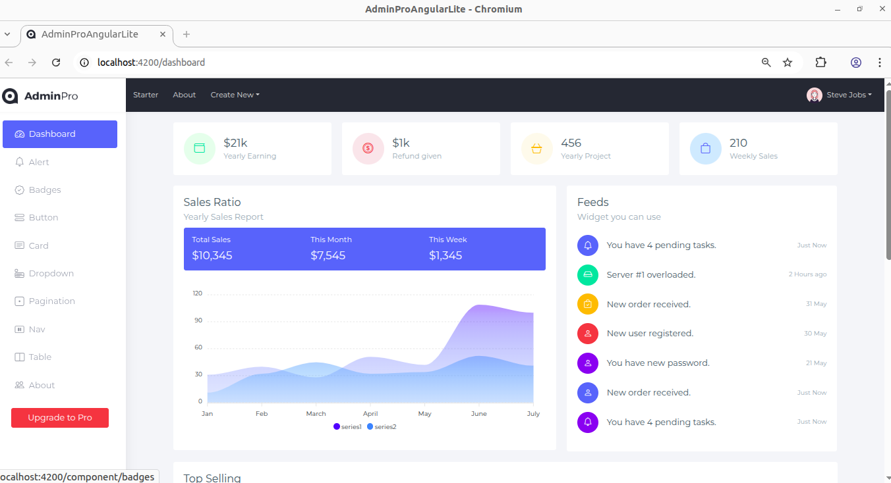
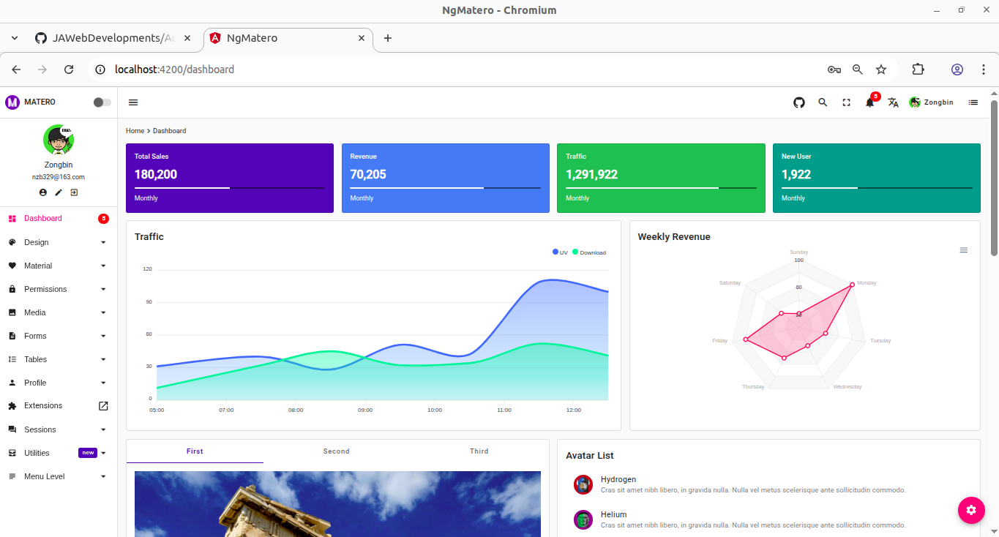

# AdminLteTemplates
In this project you can find some Admin Lte Templates for Angular

Firts you have to install:

    Node.js
    Angular CLI
    Visual Code

Then you have to run the next command

    npm install
    ng serve

## Here you are some examples:

1. AdminProAngularLite 

2. MaterialProAngularLite

3. NgMateroAngular

That's it, have fun...